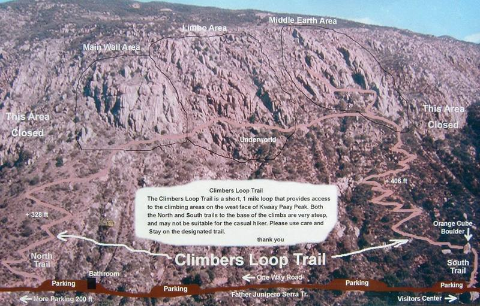

Information for Mission Gorge Climbers Associated with the Mission Gorge Super
Group (MGSG).

# News

* We now have a group chat on Signal. Contact OG to be added.

# Top-10 Routes

1. [Khazad-Dum
   (5.10a)](https://www.mountainproject.com/route/106866127/khazad-dum)
2. [Anduril (5.11a)](https://www.mountainproject.com/route/106873481/anduril)
3. [Karmic Relief (5.10a)](https://www.mountainproject.com/route/106064385/karmic-relief)
4. [Glamdring
   (5.11a)](https://www.mountainproject.com/route/106064372/glamdring)
5. [Mission Impossible
   (5.12a)](https://www.mountainproject.com/route/111465308/mission-impossible)
6. [Orange Sunshine
   (5.10b)](https://www.mountainproject.com/route/105849312/orange-sunshine)
7. [Suzie's Wild Ride
   (5.9)](https://www.mountainproject.com/route/105791566/suzies-wild-ride)
8. [Observe from the Gap
   (5.11d)](https://www.mountainproject.com/route/107428815/obverse-from-the-gap)
9. [Never Intended
   (5.10c)](https://www.mountainproject.com/route/105908560/never-intended)

# Local Legends

"Derek"

* Name: Derek
* Description: Short black hair. Always wears dark blue pants and a white
  t-shirt. Has climbed at MG/Santee for decades. He maintains the fixed gear.
* Known for: Top-rope soloing and sharing all the good beta.  
* Last seen: Feburary 2022

"Old free solo guy"

* Name: Uknown
* Description: 
* Known for: Free soloing
* Last seen: Free soloing the crack left of Khazad-Dum

"S\*xy Austrians"

* Name: Unknown
* Description: A young family of good-looking climbers. The Father seldom wears
  a shirt and is an absolute crusher.
* Known for: Sending hard routes and looking good doing it. Speaking with an
  "Austrian" accent. Yelling at plastic monkeys for top roping on the rappel
  links.
* Last seen: Unknown

"Tights and hat guy"

* Name: Uknown
* Description: Wears tights and a hat. Has long hair and carries hiking poles.
* Known for: Maintaining the trails
* Last seen: Pre-pandemic

"Speed hiking shorts guy"

* Name: Uknown
* Description: often seen quickly hiking through MG and scrambling up easy
  terrain.
* Known for: Always wearing headphones and shorts.
* Last seen: Mesa Rim, Mira Mesa location

